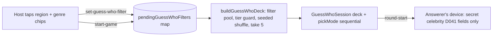

# GUESS-WHO-DESIGN: Region + Genre deck filters for Guess Who (Celebrity Edition)

> Engineering design (2026-08-06), Tech Lead deliverable. Source of truth:
> `docs/CELEBRITY-SOURCING.md` (schema §3, genre taxonomy, quotas §4, QA
> gates §5, owner decisions §6) + `docs/ARCH-DESIGN-2.md` D058 draft (§3.2
> region chip, §3.5 filter contract, §3.6 quotas, §3.7 no-lockstep
> verification). **Design only — no production code. DO NOT PUSH — report
> back for owner review.**

---

## 1. Scope + verified current state

| Fact                                                                                                                                                                                                                 | Verified     |
| -------------------------------------------------------------------------------------------------------------------------------------------------------------------------------------------------------------------- | ------------ |
| `server/src/data/celebrities.json`: **205 entries**, D041 shape only (`name, gender, alive, profession, nationality, ageRange, hairColor, famousFor, facts`) — no `region`/`genre`/`difficulty` anywhere in the file | grep + count |
| `GuessWhoSession` takes the **full pool** and picks per round via `randomIntFn` (`beginRound`, L255-271); no filter, no deck                                                                                         | read         |
| `startGuessWho` (`server/src/socket/index.ts` L1319+) constructs the session with the raw dataset — no pending-filter map                                                                                            | read         |
| Charades filtered-pool pattern to mirror: `pendingCharadesCategories` map + `set-charades-category` event + `startCharades` reads pending (default `'mixed'`) + session filters internally per round                 | read         |
| Lobby UI pattern: `RoomLobbyPanel` accepts `lobbyExtras`; `CharadesArena` renders the host `CategoryToggle` through it; guess-who lobby is plain `RoomLobbyPanel` today                                              | read         |
| Event contract is duplicated client/server by design (D011): `src/lib/events.ts` (client) and `server/src/lib/events.ts` (server; the `.js` in server imports is ESM NodeNext resolution)                            | read         |
| Client wire shape `CelebrityView` (D041 traits only) — the answerer's secret + reveal payloads                                                                                                                       | read         |
| No `server/src/data/__tests__/` directory exists yet (dataset gates will create it)                                                                                                                                  | ls           |
| Lockstep: `celebrities.json` is **server-only** (no client mirror); daily registry/lockstep tests untouched (ARCH-DESIGN-2 §3.7 verified)                                                                            | grep         |

**Boundaries:** additive-only (D006 — static JSON + engine options; no Prisma, no DB migration). No lockstep impact. Guess Who is a room game — the daily registry (11) is untouched. Text-only remains (PRD §13 — no images).

---

## 2. Additive schema (per CELEBRITY-SOURCING §3)

The server `Celebrity` type (`server/src/engine/guess-who-engine.ts` L29-40) gains three additive fields; the existing nine are untouched:

```ts
export type CelebrityRegion = 'bollywood' | 'hollywood' | 'row';
export type CelebrityGenre =
  | 'music'
  | 'cinema'
  | 'television'
  | 'sports'
  | 'politics'
  | 'business'
  | 'science'
  | 'technology'
  | 'literature'
  | 'internet'
  | 'art-fashion'
  | 'royalty';

export interface Celebrity {
  // …existing 9 fields unchanged…
  region: CelebrityRegion; // market of fame, NOT nationality (D058 §3.2)
  genre: CelebrityGenre; // primary fame domain, exactly one (closed 12)
  difficulty: 1 | 2 | 3; // ubiquity tier in the region market
}
```

**Backfill rule (D058, no forced recategorization):** existing 205 entries default `region: 'row'` unless the author knows otherwise; `genre` + `difficulty` are author-assigned per the taxonomy/calibration rules (CELEBRITY-SOURCING §3/§4); `facts` grow to ≥ 3 (current entries carry 2 — backfill flag). All three fields are **server-internal balance metadata**:

- The **wire payload never carries them** — `toWireCelebrity()` strips `region`/`genre`/`difficulty` before any emit (round-start secret, reveal, resync, game-end). `CelebrityView` on the client stays byte-identical; players can't ask "are they difficulty 2?" and the answerer's judgment isn't biased by a stored difficulty label. This is a D008-style server-keeps-what-it-needs boundary, and it keeps the FE diff minimal.
- `sources` / `aka` (owner decisions 6.3/6.6 in CELEBRITY-SOURCING) are **owner-pending and non-blocking** — not in this design.

---

## 3. Room deck-selection engine

### 3.1 Design summary

Mirror the charades filtered-pool pattern (pending map → host event → read at start), but with a **constructed deck** instead of an internal per-round filter:



### 3.2 `buildGuessWhoDeck` — pure, deterministic, testable

New `server/src/lib/guess-who-deck.ts`:

```ts
export interface GuessWhoFilter {
  region: 'all' | CelebrityRegion;
  genre: 'all' | CelebrityGenre;
}

/** Deterministic per (pool, filter, seed): same inputs ⇒ same deck. */
export function buildGuessWhoDeck(
  pool: Celebrity[],
  filter: GuessWhoFilter,
  roundCount: number, // 5
  seed: number
): Celebrity[];
```

Algorithm:

1. **Filter** (AND semantics): `region !== 'all'` ⇒ `entry.region === region`; `genre !== 'all'` ⇒ `entry.genre === genre`. Entries missing the fields (pre-backfill) are treated as `region: 'row'` defensively — the deck builder never crashes on legacy rows (the dataset gate makes this moot after the first lot).
2. **Difficulty guard — best-effort, pinned (owner decision 6.7, recommended default — flag at review):** cap tier-1 picks at **≤ 2 of the 5** rounds. The cap is a **preference order, never a size constraint** — the deck size is always `min(roundCount, filteredPool.length)`. Exact algorithm:
   1. Partition the filtered pool by difficulty; seeded-shuffle each partition (sub-seeds derived from `seed`).
   2. Fill the deck in priority order: tier-2 → tier-3 → tier-1, taking tier-1 entries only up to the cap of 2.
   3. If the deck is still short of `roundCount` after the tier-1 cap is exhausted **and** the filtered pool has more entries (e.g., a pool of 6 with 5 tier-1 and 1 tier-2 → 1 tier-2 + 2 tier-1 = 3 < 5): **the cap degrades** — fill the remaining slots from the rest of tier-1. The guard is best-effort: it never fails, never shrinks the deck below `min(roundCount, pool.length)`.
   4. If the filtered pool < `roundCount` (pool-edge), the deck is the whole filtered pool — no cap logic applies.
   5. Final seeded Fisher-Yates over the assembled deck; take `roundCount`.
3. **Seeded Fisher-Yates** over the assembled candidates (new `server/src/lib/random.ts` — `hashString` + `seededRandom`, the mulberry32 pattern already duplicated client/server; the new lib is the server's shared home, `daily-seed.ts` is left untouched to avoid churn).
4. **Take `roundCount`** (5) — the deck is exactly one game's celebrities, no repeats by construction.

**Deck-size invariant (test-enforced):** `deck.length === min(roundCount, filteredPool.length)` in every case — the tier guard never changes this.

Pool-edge: if the filtered pool < `roundCount`, the deck is the filtered pool itself (see 3.4 — the client hides such cells via the counts contract, so this path is defensive).

### 3.3 Engine change (additive, zero behavior change on existing paths)

`GuessWhoSession` gains one constructor option:

```ts
constructor(celebrities: Celebrity[], options: {
  randomInt?: (max: number) => number;
  pickMode?: 'random' | 'sequential';   // NEW, default 'random'
} = {})
```

- `beginRound` (L255-271): `pickMode === 'sequential'` ⇒ `this.celebrities[(this.roundNumber - 1) % this.celebrities.length]` (the deck is pre-shuffled, so this is random-looking, **repeat-free, and fully deterministic**); otherwise the existing `randomIntFn` path — every current test and the 205-pool behavior are untouched.
- No `totalRounds` change, no filter logic in the engine — the session stays transport-agnostic and deck-agnostic. The deck is the unit of determinism.

### 3.4 Determinism contract (per room)

- Seed = `hashString(`${roomCode}:${gameSerial}`)` where `gameSerial` increments per game start **within the same room** — rematches re-deal; fixed inputs reproduce the deck exactly, which is what the tests assert.
- **Serial persistence (architect fix 3):** the counter lives in a dedicated socket-layer map `guessWhoGameSerials: Map<string, number>` — it must **NOT** be cleaned by `clearRoomGame`, which is invoked on every game start and would reset it (the bug the architect caught). Lifecycle:
  - Read + increment at `startGuessWho` (first game in a room ⇒ serial 1).
  - **Deleted on room teardown only** — in the `leaveRoom` handler's `becameEmpty` branch (verified: `server/src/socket/index.ts` L1526-1532), co-located with the existing `clearRoomGame(room.code); scheduleEviction();` cleanup. Room codes are not reused, so a fresh room starts at serial 1 by construction; the teardown delete keeps the map bounded (every room that ever starts a game eventually empties).
- The round order is deterministic too (sequential consumption of a seeded deck). Different rooms/codes ⇒ different decks (room codes are random 6-char).
- **Fallback (defensive only):** if the filtered pool < 5 at start (race between counts and start), fall back to `{ region: 'all', genre: 'all' }` and log — the pool floor (205+) always yields a valid deck. Never fails the start.

---

## 4. Lobby filter contract (FE consumes)

### 4.1 Events (D011 — add to both `src/lib/events.ts` and `server/src/lib/events.ts`)

| Event                                     | Direction       | Payload                                                                                      | Notes                                                                                                                |
| ----------------------------------------- | --------------- | -------------------------------------------------------------------------------------------- | -------------------------------------------------------------------------------------------------------------------- |
| `set-guess-who-filter` (ClientEvents)     | client → server | `{ roomCode, region: 'all'\|'bollywood'\|'hollywood'\|'row', genre: 'all'\|CelebrityGenre }` | Host-only (reject non-host like the trivia-mode toggle); validates the enum values; upserts `pendingGuessWhoFilters` |
| `guess-who-filter-options` (ServerEvents) | server → client | `{ regions: { value, count }[], genres: { value, count }[] }`                                | Pool statistics so the FE can render chips + hide empty cells; emitted on room-created + on join (idempotent)        |
| (start-game ack)                          | server → client | existing ack + `filter: GuessWhoFilter` (echo of what was applied)                           | The FE shows the applied filter in the lobby + round header ("Region: Bollywood · Genre: All")                       |

### 4.2 Filter availability (the "hide empty cells" contract)

- The server computes counts once per start/join from the pool: regions = counts per `region` (all four incl. `all` = pool length), genres = counts per `genre` (13 incl. `all`).
- **FE rule:** a chip renders only when `count ≥ GUESS_WHO_TOTAL_ROUNDS (5)` — the B.3.2 guard semantics from ARCH-DESIGN-2 §3.1 (hidden, never disabled). Since `region: 'all'` is always ≥ 5, the default state always renders.
- Labels are static FE maps (`REGION_LABELS`, `GENRE_LABELS` — 12 entries mirroring the taxonomy; unknown values render as the raw string as a fallback — the counts contract never ships labels).

### 4.3 FE state (additive to `src/lib/guess-who.ts` reducer)

- `filter: GuessWhoFilter` (default `{ region: 'all', genre: 'all' }`) — set from the start ack; echoed in the lobby/round header.
- `filterOptions: { regions: {value,count}[]; genres: {value,count}[] } | null` — set from `guess-who-filter-options`; `null` until received (chips render nothing, no flash of a wrong state).
- `useGuessWhoGame` exposes `setFilter` (emits `set-guess-who-filter`, host-only gated by the existing room state's `isHost`).

### 4.4 UI

`GuessWhoArena.tsx` renders `lobbyExtras` (host-only) into `RoomLobbyPanel` — two chip rows (Region: All/Bollywood/Hollywood/RoW · Genre: All + 12), exactly the `CategoryToggle` pattern from `CharadesArena` (L261-286), with `aria-pressed` and the house pill styling. Non-host players see the applied filter text in the lobby; the round header echoes it (same pill style as the charades category pill).

---

## 5. Dataset QA gates

New `server/src/data/__tests__/celebrities.test.ts` (the first file in that directory), per CELEBRITY-SOURCING §5. **Ships WITH the first content lot** (the current 205 fail `facts ≥ 3` and lack all three new fields — gates-before-content would red `pnpm verify`, the repo's standing rule):

1. **Schema:** all 9 base fields + `region` + `genre` + `difficulty`; correct types; strings non-empty; `facts` ≥ 3 non-empty strings; `famousFor` ≤ 5 tokens.
2. **Enums:** `region ∈ {bollywood, hollywood, row}`; `genre` ∈ the closed 12; `difficulty ∈ {1,2,3}`; `gender ∈ {m, f}`; `ageRange` matches `^\d+s$`.
3. **Region quotas (cumulative, D058 §3.6):** bollywood ≥ 400, hollywood ≥ 400, row ≥ 200 at v1 (1,000); v2 thresholds at 2,000+.
4. **Uniqueness:** normalized display names unique (lowercase, NFD-strip diacritics, collapse whitespace) — catches shared stage names.
5. **Genre balance:** no single genre > 40%; each of the 12 genres ≥ 20 entries at 1,000 (guarantees "are they in X?" is always live).
6. **Difficulty mix:** tier 1 ≤ 40%, tier 3 ≥ 15% of the pool.
7. **Alive/gender sanity:** both genders ≥ 30%; `alive` has both values; deceased ≥ 10%.

Plus the manual spot-check rules from CELEBRITY-SOURCING §5 (two-source per fact, region/nationality consistency, neutrality, `famousFor` format, `hairColor` sourcing, difficulty honesty) — authoring-side, logged per lot.

---

## 6. File-level task briefs

> Verify-green at every PR. No new dependencies. No `src/styles/global.css` / `src/components/ui/*` changes. `celebrities.json` stays server-only (no client mirror).

### Backend Engineer

**BE1 — Schema + random lib + deck builder**

- Files: `server/src/engine/guess-who-engine.ts` (types + `pickMode` option), `server/src/lib/random.ts` (new: `hashString`, `seededRandom`), `server/src/lib/guess-who-deck.ts` (new: `GuessWhoFilter`, `buildGuessWhoDeck`, `toWireCelebrity`), `server/src/lib/__tests__/guess-who-deck.test.ts` (new).
- Acceptance: deck deterministic per (pool, filter, seed) — golden tests; tier-1 ≤ 2 of 5; no repeats; pool-edge (filtered < 5 → deck = filtered pool, no crash); legacy rows without new fields don't crash the builder; `toWireCelebrity` strips the three fields; existing engine tests green unchanged (default `pickMode: 'random'`).

**BE2 — Socket adapter + filter plumbing + serial lifecycle**

- Files: `server/src/lib/events.ts` (+2 events), `server/src/socket/index.ts` (`pendingGuessWhoFilters` map; **`guessWhoGameSerials: Map<string, number>`** — read/increment at start, deleted in the `leaveRoom` handler's `becameEmpty` branch, **never** in `clearRoomGame` (architect fix 3); `set-guess-who-filter` handler — host-gated, enum-validated, upsert; `startGuessWho` reads pending (default all/all) → deck with seed `hashString(roomCode:serial)` → `new GuessWhoSession(deck, { pickMode: 'sequential' })`; `guess-who-filter-options` emitted on room-created/join; wire payloads use `toWireCelebrity`; fallback to all/all + log when filtered < 5), `server/src/__tests__/special.sockets.integration.test.ts` (extend: filter journey — set filter → start → 5 rounds, every secret matches the filter, tier-1 ≤ 2, non-host set-filter rejected, filter-options received on join; **rematch (restart in the same room) re-deals a different deck (serial 1 → 2)**).
- Acceptance: full journey green; existing guess-who socket suite green; no answerer/reveal payload contains `region`/`genre`/`difficulty` (assert in the integration test); rematch re-deals (integration); serial map is deleted at `becameEmpty` teardown and never in `clearRoomGame` (code-review gate + bounded-by-construction argument in the PR description).

### Frontend Engineer

**FE1 — Lobby filter UI + reducer**

- Files: `src/lib/events.ts` (+2 event names), `src/lib/guess-who.ts` (reducer: `filter`, `filterOptions` state + actions; `CelebrityView` untouched), `src/islands/GuessWhoArena.tsx` (lobby chips via `lobbyExtras`, host-only; `REGION_LABELS`/`GENRE_LABELS` maps; chips hidden when `count < 5`; filter echo in lobby + round header), `src/lib/__tests__/guess-who.test.ts` (**new** — no client reducer test exists today: filter set from start ack, options stored, unknown genre label fallback).
- Acceptance: host sees two chip rows with counts; non-host sees the applied filter; cells < 5 hidden; start applies the filter (verified via the round header + secrets); `CelebrityView` and all existing reducer tests untouched; `pnpm verify` green.

### Content lot (L12 — celebrities, bollywood first; parallel, non-blocking for BE/FE)

**L12 — Backfill + expansion**

- Files: `server/src/data/celebrities.json`, `server/src/data/__tests__/celebrities.test.ts` (new — ships with this lot).
- Scope: (1) backfill all 205 existing entries — `region` (default `row` per D058), `genre` + `difficulty` author-assigned, `facts` to ≥ 3; (2) expand bollywood-first toward v1: total 1,000 with bollywood ≥ 400, hollywood ≥ 400, row ≥ 200; (3) the 20-entry proof-of-model from CELEBRITY-SOURCING §5 lands with the first lot as the style reference.
- Gates: §5 suite green (cumulative per lot); two-source rule + spot checks per CELEBRITY-SOURCING §5.2; the extract script `scripts/extract-celebrity-candidates.mjs` + `docs/celebrities-candidates.json` (859 candidates) is the input pool — candidates are pre-screened, never shipped unresolved.
- Acceptance: dataset gates green, deck golden tests re-run against the grown pool (determinism holds — pool is an input, seeds unchanged), `pnpm verify` green.

---

## 7. Sequencing + risks

```
PR1  BE1 + FE1 (engine + deck + adapter + lobby UI) — works with the 205 pool,
     'all'/'all' default; ships independently  (no dataset dependency)
PR2  L12 backfill + expansion + dataset gates  (content, parallel to PR1)
PR3  Final gate: deck goldens vs grown pool, special-suite re-run, pnpm verify
```

| #   | Risk                                                                                                           | Mitigation                                                                                                                                                                                          |
| --- | -------------------------------------------------------------------------------------------------------------- | --------------------------------------------------------------------------------------------------------------------------------------------------------------------------------------------------- |
| 1   | **Backfill debt** — 205 entries fail the new gates until backfilled                                            | Gates ship with L12, never before (verify-green rule)                                                                                                                                               |
| 2   | **Deck determinism vs rematch boredom** — same room, same celebrities every game                               | `gameSerial` in the seed; rematches re-deal. The serial is room-keyed and removed **at room teardown only** (never by `clearRoomGame` — architect fix 3), so it survives restarts and stays bounded |
| 3   | **Tier-guard balance** — all-tier-1 or all-tier-3 rooms                                                        | `buildGuessWhoDeck` tier guard (≤ 2 of 5 tier-1) + pool mix quotas (gates 5-6); the guard is owner-decision-7 recommended, flag at review                                                           |
| 4   | **Filter race** — counts said ≥ 5, start finds < 5 (data changed mid-lobby)                                    | Server falls back to all/all + log; never fails the start                                                                                                                                           |
| 5   | **Wire leakage of balance fields** — `difficulty` reaching players biases judging                              | `toWireCelebrity` strip + integration-test assertion                                                                                                                                                |
| 6   | **Genre taxonomy drift** — FE labels vs BE union diverge over time                                             | Counts contract ships values only; FE label map falls back to raw strings; the 12-value union is frozen by the dataset enum gate (test 2)                                                           |
| 7   | **Sitelink/Wikidata quality skew** (CELEBRITY-SOURCING Risks)                                                  | Two-source rule + review-list gate; per-region difficulty judgment; spot-check sampling                                                                                                             |
| 8   | **Pool floor regression** — if a future filter yields < 5 legitimately (e.g., a 12-genre cell at small volume) | FE hides cells < 5 by contract; server fallback covers races only                                                                                                                                   |

---

## 8. Owner review asks

1. **Deck tier guard (≤ 2 tier-1 of 5)** — implemented in the deck builder per CELEBRITY-SOURCING owner decision 6.7's recommendation as a **best-effort cap** (never shrinks the deck below `min(roundCount, pool.length)`); confirm or drop.
2. **`sources`/`aka` fields** (CELEBRITY-SOURCING §6.3/6.6) stay owner-pending — non-blocking for this design.
3. **Difficulty in the schema** is included (the tier guard needs it); if you want the guard dropped, difficulty remains a harmless authoring field.

> Architect review (2026-08-06): **RETURN FOR CHANGES → 3 fixes applied** — (1) `server/src/lib/events.ts` path corrected throughout; (2) tier-guard fallback pinned to best-effort semantics with the deck-size invariant; (3) `gameSerial` moved to a dedicated room-keyed map, deleted at room teardown, never in `clearRoomGame`. Rematch re-deal confirmed by the owner. **Ready to resubmit for APPROVE.**

Design-only deliverable — nothing pushed. Ready for owner review, then the Software Architect pass before engineers start.
